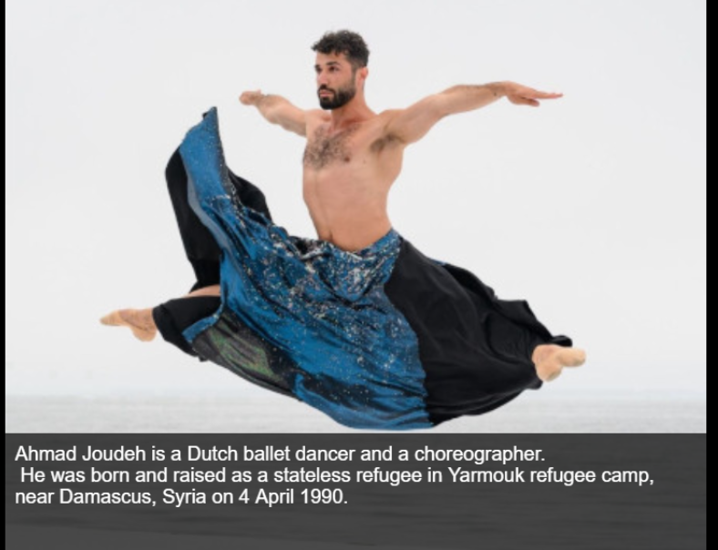

# Ahmad Joudeh 
A short story and chat diologue about Ahmad Joudeh, a Dutch ballet dancer and a choreographer. He was born and raised as a stateless refugee in Yarmouk refugee camp, near Damascus, Syria. The game/story is aimed at ages 18-25, the 1-2 minute game offers a quick look into the life of Ahmad. 

## Link to working game: 
https://play.rosebud.ai/games/8cbc257e-3062-4fd2-8af5-b6c6ee3928ae

## Link to deployed repo:

Note: The code used for the chat is specific to the Rosebud platform and therefore will not run in the deployed GitHub link. 

https://vickysug.github.io/ahmad-joudeh/

## Project Brief

This project was one of several while on my internship with BIZGEES. The brief:

* Select a celebrity/famous person who was/is a refugee.

* Compile the information and background.

* Create a short 30 second - 2 minute game aimed at age group 18 -25.

* The game is to allow the player to learn about the refugee.

* Use AI to aid the creation.

## Technologies used

For the project the aim was to use AI, mainly Rosebud AI (https://play.rosebud.ai/home)

On the platform a developer can clone games created by other developers and change them for their own purpose. 

I chose to use a game called The Galena Uprising, Evolved from: Visual Novel AI Template, Created by: aikostvn.

https://play.rosebud.ai/games/3111eef5-e349-459b-8028-1b9ddc647de7

Rosebud can generate AI images, I created some in Rosebud and some I searched for and edited in Photoshop. 
Rosebud also allows the AI chat to change code, I used this as well as coding myself. 

If I were to expand the game further, it would include another scene where the player could view dance images.

